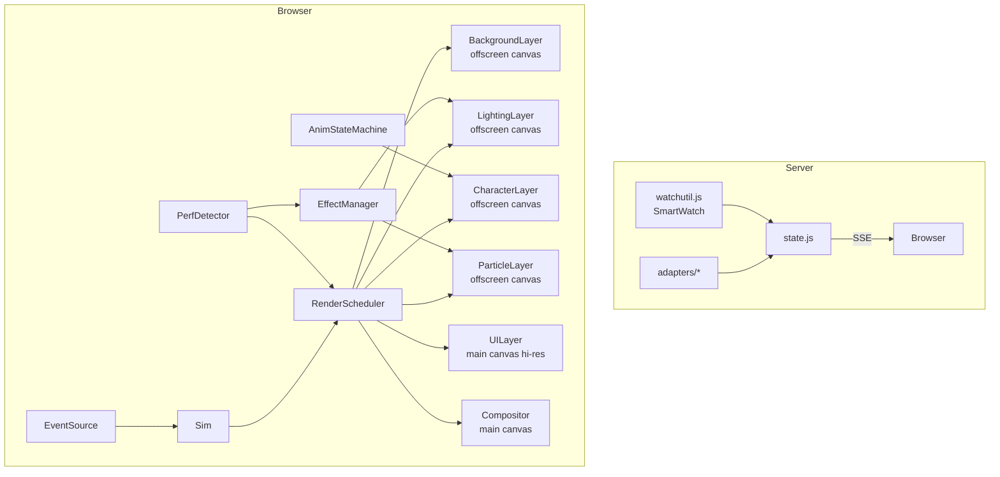

# Technical Design: Performance & Visual Improvements

## Overview

This design introduces a layered rendering pipeline with dirty-region tracking, a pooled particle/effect system, an animation state machine per character, and a tiered graceful degradation framework — all integrated into the existing single-page canvas architecture. The server-side `watchTree` is refactored to prefer event-driven `fs.watch` with a targeted poll fallback. No build step or bundler is added; all new code is vanilla ES5/ES6 in separate `<script>` files loaded from `web/`.

## Architecture

### System Context

The existing system has three layers:

1. **Server** (`server/index.js`, `state.js`, `watchutil.js`, adapters) — watches CLI session files, normalizes agent state, pushes diffs over SSE.
2. **Simulation** (`web/sim.js`) — assigns rooms, paths characters through waypoints, manages lifecycle phases.
3. **Renderer** (`web/office.js`) — single-pass full-scene redraw every `requestAnimationFrame` tick.

The new architecture inserts two systems between simulation and final canvas output:

- A **RenderScheduler** that gates frame production based on dirty flags, manages idle throttling, and orchestrates layered compositing.
- An **EffectManager** that owns particle pools, lighting overlays, and ambient animations, respecting the current performance tier.

### Component Diagram



## Detailed Design

### RenderScheduler (`web/render-scheduler.js`)

#### Purpose

Central orchestrator that decides when to draw, which layers are dirty, and manages the idle↔active frame rate transition.

#### Interface

```js
window.RenderScheduler = {
  create(options) → scheduler,
};

// scheduler instance:
{
  markDirty(layer),          // layer: 'bg'|'lighting'|'chars'|'particles'|'ui'
  markAllDirty(),
  isIdle(),
  wake(),                    // force resume to 60fps
  tick(timestamp),           // called from rAF; returns true if a frame was produced
  onFrame(callback),         // register the compositor callback
}
```

#### Behavior

1. Maintains a `dirtyFlags` object: `{ bg: false, lighting: false, chars: false, particles: false, ui: false }`.
2. On each `requestAnimationFrame`, checks if any flag is set. If none, increments an `idleFrames` counter.
3. When `idleFrames` exceeds `IDLE_THRESHOLD` (≈120 frames at 60fps = 2s), enters idle mode: schedules next rAF callback with a `setTimeout` gate of 250ms (≈4fps).
4. Any call to `markDirty()` or `wake()` resets `idleFrames` to 0 and clears the timeout gate, resuming 60fps.
5. When a frame is produced, calls the compositor callback with the set of dirty layers so it can skip unchanged ones.

#### Dependencies

- None (standalone module). Consumed by the `Office` constructor.

---

### EffectManager (`web/effects.js`)

#### Purpose

Manages all visual effects (particles, ambient animations, lighting) with pre-allocated object pools. Respects the current performance tier from `PerfDetector`.

#### Interface

```js
window.Effects = {
  EffectManager,
  Tier: { FULL: 3, REDUCED: 2, MINIMAL: 1 },
};

// EffectManager instance:
{
  setTier(tier),
  emit(type, config),        // type: 'sparkle'|'poof'|'thinkDots'|'ambient'
  update(dt),                // advance all active effects
  drawParticles(ctx),        // render particle layer
  drawLighting(ctx, chars),  // render lighting layer (desk glows, status glows)
  drawAmbient(ctx, dt),      // render ambient animations (monitor flicker, plant sway)
}
```

#### Behavior

**Object Pool**: At init, pre-allocates arrays of particle objects (capacity 128). Each particle is `{ active, x, y, vx, vy, life, maxLife, color, size }`. `emit()` scans for an inactive slot rather than allocating.

**Tier Gating**:
- Tier 1 (MINIMAL): No effects run; `update`/`draw*` are no-ops.
- Tier 2 (REDUCED): Particles and ambient disabled; lighting still renders.
- Tier 3 (FULL): All effects active.

**Ambient Animations**:
- Monitor flicker: per-desk timer stored in `deskStates[]`; each entry has `{ phase, nextChangeAt, colorIdx }`. On `drawAmbient()`, if `scheduler.isIdle()`, skip (requirement 2.2 AC3).
- Plant sway: sine-wave offset per plant instance, phase-randomized at init.

**Lighting**:
- Desk lamp glow: radial gradient (warm #FFE4B5 → transparent) at 32px radius, drawn only for desks with an occupant.
- Status glow: 4–6px soft circle behind working characters in their source color.
- Day/night tint: full-canvas `fillRect` with computed RGBA based on `new Date().getHours()`. Opacity capped at 0.15.

#### Dependencies

- `RenderScheduler` (calls `markDirty('particles')`, `markDirty('lighting')`).
- `Sim` (reads `chars` for occupant positions, agent status).
- `Sprites.SOURCE_COLORS` for status glow colors.

---

### AnimStateMachine (`web/anim-state.js`)

#### Purpose

Each character gets an `AnimState` that drives sprite frame selection, manages transitions between states, and triggers reaction animations on status changes.

#### Interface

```js
window.AnimState = {
  create(character) → animState,
};

// animState instance:
{
  update(dt),
  currentFrame(),            // returns frame key: 'stand'|'walk1'|'walk2'|'sleep'|'typing1'|'typing2'|'lean'|'bob'
  currentBob(),              // vertical pixel offset
  isActive(),                // true if any animation is playing (used by scheduler)
  onStatusChange(oldStatus, newStatus),  // triggers reaction
}
```

#### Behavior

**State Table**:
| Agent Status | Phase    | Animation             | FPS  |
|-------------|----------|-----------------------|------|
| working     | atDesk   | typing1↔typing2 cycle | 4    |
| thinking    | atDesk   | lean + slow bob       | 2    |
| waiting     | atDesk   | bounce (sine)         | —    |
| idle        | atDesk   | sleep (static)        | 0    |
| *           | walking  | walk1↔walk2 cycle     | 6    |

**Reactions**: On `onStatusChange()`, sets a `reaction` property: `{ type, elapsed, duration }`. Types:
- `working→waiting`: small upward jump (3px over 0.3s, ease-out-bounce).
- `*→idle`: settle (1px down over 0.4s, ease-in).
- `gone→*` (respawn): none (handled by poof effect).

Reactions override `currentBob()` for their duration, then clear.

**Idle detection**: `isActive()` returns `true` when `path.length > 0`, or when the frame is cycling (working/thinking), or when a reaction is playing. Returns `false` for `idle`+`atDesk` — enabling the scheduler to skip that character's update.

#### Dependencies

- `Character` from `sim.js` (reads `phase`, `path`, `agent.status`).
- Consumes easing functions from `web/ease.js`.

---

### PerfDetector (`web/perf-detect.js`)

#### Purpose

Monitors actual frame times and auto-adjusts the effect tier to maintain smooth rendering.

#### Interface

```js
window.PerfDetect = {
  create(scheduler, effectManager) → detector,
};

// detector instance:
{
  sample(frameDurationMs),   // called each frame by the scheduler
  currentTier(),
  forceTier(n),              // URL param override: ?fx=1|2|3
}
```

#### Behavior

1. Maintains a rolling ring buffer of 60 frame-time samples.
2. Every 60 samples, computes the average.
3. If average > 16ms for 2 consecutive windows → `setTier(current - 1)` (reduce).
4. If average < 12ms for 2 consecutive windows AND current tier < FULL → `setTier(current + 1)` (restore).
5. Anti-flap: after any tier change, ignores samples for 300 frames (≈5s at 60fps).
6. Reads `?fx=` URL param at init; if present, locks tier and disables auto-detection.

#### Dependencies

- `RenderScheduler` (provides frame timestamps).
- `EffectManager` (receives `setTier()` calls).

---

### Compositor (integrated into `Office.draw()`)

#### Purpose

Composites the layered offscreen canvases onto the main visible canvas, only re-drawing layers that are dirty.

#### Behavior

The `Office` class gains offscreen canvases:
- `this.bgCanvas` (480×320) — tilemap, furniture, decorations. Redrawn only on resize.
- `this.lightCanvas` (480×320) — desk glows, day/night tint, status glows.
- `this.charCanvas` (480×320) — character sprites, selection rings.
- `this.particleCanvas` (480×320) — all particle effects.
- UI (names, bubbles, plaques) drawn directly on the main canvas at 3× resolution (as today).

Compositing order on main canvas:
1. `bgCanvas` (always present, rarely redrawn)
2. `lightCanvas` (below characters)
3. `charCanvas`
4. `particleCanvas` (above characters)
5. UI text (drawn at full resolution directly on main ctx)

Only layers marked dirty are re-rendered before compositing. The compositor always draws all 4 offscreen images to the main canvas (cheap `drawImage` calls).

---

### SmartWatch (refactored `server/watchutil.js`)

#### Purpose

Replace blanket recursive directory scans with event-driven notification plus targeted stat-only polling of known files.

#### Interface

```js
// Unchanged external API:
module.exports = { tailRead, watchTree };

// watchTree gains internal optimization — same signature:
watchTree(dir, filter, onChange) → stopFn
```

#### Behavior

**Native mode** (macOS/Linux without Docker):
1. `fs.watch(dir, { recursive: true })` is the primary event source.
2. On `change` event, stat only the reported filename (not a full tree walk).
3. A **known-files index** (`Map<path, {size, mtimeMs}>`) is populated on first scan and updated incrementally.
4. Fallback poll interval increases to 5000ms (from 2000ms) — only runs as a safety net.

**Docker mode** (detected via `/.dockerenv` or `DOCKER_WATCH=1`):
1. `fs.watch` is still attempted but not relied upon.
2. Poll interval stays at 2000ms but only `fs.statSync`s files already in the known-files index.
3. A full `readdirSync` scan runs once every 30s to discover new session files.
4. Result: CPU proportional to number of known files, not directory depth.

**Known-files index management**:
- Files added on first discovery (full scan or `fs.watch` event for a new path).
- Files removed from index when `statSync` throws `ENOENT` (session file deleted).
- Index bounded: entries with `mtimeMs` older than `REMOVE_AFTER_MS` (40min, matching state.js) are pruned on each slow-scan cycle.

#### Dependencies

- `fs`, `path` (Node built-ins).
- No new dependencies.

---

### Easing Library (`web/ease.js`)

#### Purpose

Tiny vendored easing utility (< 3KB) providing common easing functions for walk smoothing and reaction animations.

#### Interface

```js
window.Ease = {
  linear(t),
  easeInOut(t),
  easeOutBounce(t),
  easeInQuad(t),
  easeOutQuad(t),
};
```

All functions take `t` in [0, 1] and return a value in [0, 1] (approximately, for bounce).

---

### New Sprite Frames (additions to `web/sprites.js`)

#### Purpose

Add `typing1`, `typing2`, and `lean` frames for seated character animation.

#### Behavior

- `typing1`: arms forward variant — pixels at rows 8–11 shift to show hands on laptop.
- `typing2`: slight arm raise — 1px arm-pixel shift from `typing1`.
- `lean`: head tilted right by 1px, body shifted — used for thinking fidget.

Frames are added to the existing `FRAMES` object and auto-rendered by `buildSprites()`.

## Data Models

### DirtyFlags

```js
{
  bg: Boolean,          // true after window resize
  lighting: Boolean,    // true when occupancy changes, clock hour changes, status changes
  chars: Boolean,       // true when any character moves, animates, or status changes
  particles: Boolean,   // true when any particle is active
  ui: Boolean,          // true when bubble text changes, selection changes, room labels change
}
```

### Particle

```js
{
  active: Boolean,
  x: Number,           // world-space px (480×320 coordinate system)
  y: Number,
  vx: Number,          // velocity px/s
  vy: Number,
  life: Number,        // seconds remaining
  maxLife: Number,      // initial life (for alpha fade calculation)
  color: String,       // CSS color
  size: Number,        // 1 or 2 px
}
```

Pool size: 128 particles (covers all simultaneous effects for up to 8 characters + ambient sources).

### DeskState (ambient animations)

```js
{
  deskTx: Number,      // tile x of the desk
  deskTy: Number,      // tile y of the desk
  flickerPhase: Number,    // current brightness index (0–2)
  nextFlickerAt: Number,   // timestamp for next color shift
  occupied: Boolean,       // derived from character positions
}
```

### AnimState (per character)

```js
{
  frameKey: String,         // current sprite frame name
  frameClock: Number,       // accumulator for frame cycling
  reaction: null | { type: String, elapsed: Number, duration: Number },
  prevStatus: String,       // for detecting transitions
}
```

### EffectTier

```js
{
  current: 1 | 2 | 3,
  locked: Boolean,          // true if ?fx= param was provided
  cooldownFrames: Number,   // frames remaining before next tier change allowed
  windowScores: [Number, Number],  // last two 60-frame average durations
}
```

### SmartWatch KnownFile

```js
// Map<String, KnownFile> inside watchTree closure
{
  size: Number,
  mtimeMs: Number,
}
```

## Key Algorithms

### Dirty-Region Character Update

```
on each rAF tick:
  for each character c in sim.chars:
    if c.animState.isActive():
      oldBounds = boundingRect(c)    // old position + bubble height
      c.update(dt)
      c.animState.update(dt)
      newBounds = boundingRect(c)    // new position
      markDirty('chars')
      markDirty('ui') if bubble content changed
    else:
      // skip update entirely (req 1.3)
      continue
```

### Idle Throttle State Machine

```
state = ACTIVE
idleCounter = 0

on rAF callback:
  if state == ACTIVE:
    if no dirty flags set:
      idleCounter++
      if idleCounter >= 120:  // ~2s at 60fps
        state = IDLE
    else:
      idleCounter = 0
      produce frame

  if state == IDLE:
    schedule next callback via setTimeout(rAF, 250)  // ~4fps
    // only produce frame if markDirty was called
    if any dirty flag:
      state = ACTIVE
      idleCounter = 0
      produce frame

on SSE event, mouse event, or wake():
  state = ACTIVE
  idleCounter = 0
  // cancelTimeout if pending
```

### Performance Auto-Detection

```
ringBuffer[60]
writeIdx = 0
windowCount = 0
lastAvg = 0
cooldown = 0

sample(dt):
  if cooldown > 0: cooldown--; return
  ringBuffer[writeIdx] = dt
  writeIdx = (writeIdx + 1) % 60
  if writeIdx == 0:
    avg = mean(ringBuffer)
    if avg > 16 and lastAvg > 16:
      reduceTier()
      cooldown = 300
    elif avg < 12 and lastAvg < 12 and tier < FULL:
      restoreTier()
      cooldown = 300
    lastAvg = avg
```

### Walk Easing

```
// In Character.update(dt), replace linear step with eased interpolation:

segmentProgress = distanceTraveled / segmentLength   // 0..1
easedProgress = Ease.easeInOut(segmentProgress)
position = lerp(segmentStart, segmentEnd, easedProgress)

// Total segment time preserved within 10% of original:
// segmentTime = segmentLength / WALK_SPEED (unchanged)
// Easing only reshapes the velocity curve, not total duration
```

### Smart Watch — Docker Targeted Poll

```
knownFiles = Map<path, {size, mtimeMs}>

// Initial full scan (once at start):
entries = readdirSync(dir, { recursive: true })
for each entry matching filter:
  stat it, add to knownFiles, call onChange

// Fast poll (every 2s):
for each [path, prev] of knownFiles:
  try stat = statSync(path)
  catch ENOENT: knownFiles.delete(path); continue
  if stat.size != prev.size or stat.mtimeMs != prev.mtimeMs:
    knownFiles.set(path, {size, mtimeMs})
    onChange(path, stat)

// Slow discovery scan (every 30s):
entries = readdirSync(dir, { recursive: true })
for each new file not in knownFiles:
  add to knownFiles, call onChange
```

## File Changes

### New Files

| Path | Purpose |
|------|---------|
| `web/render-scheduler.js` | Frame scheduling, dirty-flag tracking, idle throttling |
| `web/effects.js` | EffectManager with particle pools, lighting, ambient animations |
| `web/anim-state.js` | Per-character animation state machine, reaction system |
| `web/perf-detect.js` | Frame-time sampling, auto tier adjustment |
| `web/ease.js` | Vendored easing functions (<3KB) |

### Modified Files

| Path | Changes |
|------|---------|
| `web/index.html` | Add `<script>` tags for new modules (before `office.js`). Wire SSE handler to call `scheduler.wake()`. Read `?fx=` param and pass to PerfDetector. |
| `web/office.js` | Refactor `Office` class: replace single-pass `draw()` with layered compositor. Add offscreen canvases. Replace direct `requestAnimationFrame` loop with `RenderScheduler.tick()`. Integrate `EffectManager` draw calls. Replace `Character.frame()`/`bob()` calls with `AnimState` queries. |
| `web/sim.js` | Remove `frame()` and `bob()` methods from `Character` (moved to `AnimState`). Add `animState` property to `Character`. Modify `Character.update()` to be a no-op when `!this.animState.isActive()`. Add eased interpolation in path-following logic. |
| `web/sprites.js` | Add `typing1`, `typing2`, `lean` frame data to `FRAMES` object. No structural changes to `buildSprites()`. |
| `server/watchutil.js` | Refactor `watchTree` internals: add known-files index, separate native vs Docker mode, increase fallback poll to 5s (native) or keep 2s targeted (Docker), add 30s slow-discovery scan for Docker. External API unchanged. |

## Correctness Properties

### Property 1: Zero Draw Calls When Idle

When all characters have `phase === 'atDesk'` and `agent.status === 'idle'` and no particles are active and no ambient animations are running, the `RenderScheduler` produces zero compositor callbacks between rAF ticks. Verified by: after 2s of no state changes, `dirtyFlags` remains all-false and no canvas context methods are invoked.

### Property 2: Existing Visual Fidelity Preserved

All characters, bubbles, names, status indicators, room plaques, and the tilemap render at identical pixel positions and sizes as before. The layered compositor must produce output visually indistinguishable from the current single-pass `draw()` — validated by screenshot comparison with `?fx=1` (tier-1 only, effects off).

### Property 3: Particle Pool Never Allocates at Runtime

After initialization, `EffectManager.emit()` never creates new particle objects. If all pool slots are active, the emit is silently dropped. Pool size (128) is sufficient for worst-case: 8 characters × 5 sparkles + 10 ambient + 8 poof burst = 58 concurrent particles.

### Property 4: Tier Changes Are Monotonic Within Cooldown

Once a tier change occurs, no further tier change can happen for at least 300 frames (≈5s). This prevents visual flapping. The `cooldown` counter is only decremented, never reset to a lower value from outside.

### Property 5: SSE Protocol Unchanged

The server emits identical JSON messages (`{type:'agent', agent}`, `{type:'remove', id}`, `{type:'snapshot', agents}`) over the same `/events` endpoint. No new message types are added. No existing fields are removed or renamed.

### Property 6: watchTree External Contract Preserved

`watchTree(dir, filter, onChange)` continues to return a stop function and invoke `onChange(file, stat)` for every matching file that appears or grows. Callers (adapters) require zero changes. Internal optimization is transparent.

### Property 7: No Build Step Required

All new files are vanilla JavaScript loaded via `<script>` tags. The project continues to run with `npm start` (which runs `node server/index.js`). No transpilation, no bundler, no package.json `scripts.build` entry.

## Performance Considerations

**Frame budget**: At 60fps, each frame has 16.6ms. The current full-redraw takes ~4–6ms on a mid-range machine (canvas 2D at 480×320 is fast). The new layered approach adds:
- Compositor overhead: 4 `drawImage` calls at 480×320 → ~0.3ms.
- Per-frame savings: skipping background re-render saves ~2ms; skipping idle characters saves proportionally.
- Net effect: leaves ~10ms headroom for effects, well within budget even with particles + lighting.

**Memory**: 4 offscreen canvases at 480×320×4 bytes = 2.4MB total. Particle pool = 128 × ~80 bytes = ~10KB. Negligible.

**GC pressure**: Object pooling for particles eliminates per-frame allocation. AnimState reuses the same reaction object. DeskState array is fixed-size. Only the ring buffer in PerfDetector rotates, with no allocations.

**Server CPU**: SmartWatch in Docker mode stats only known files (typically 2–10) every 2s instead of walking a tree of potentially hundreds of entries. With 5 active sessions, this reduces stat calls from O(n_files_in_tree) to O(5).

**Idle power**: When the office is empty or all agents are idle, the render loop drops to 4fps and characters consume zero per-frame compute. Combined with disabled ambient animations in idle mode, CPU usage approaches zero (validated against requirement 1.2 AC3: ≥80% reduction).
