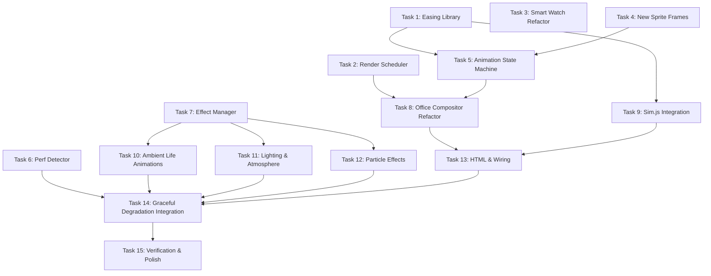

# Tasks: Performance & Visual Improvements

## Task Dependency Graph

## Tasks

### Task 1: Create Easing Library (`web/ease.js`)

- [ ] Create `web/ease.js` with `window.Ease` namespace
- [ ] Implement `linear(t)` — identity function
- [ ] Implement `easeInOut(t)` — cubic ease-in-out for walk smoothing
- [ ] Implement `easeOutBounce(t)` — for waiting reaction animation
- [ ] Implement `easeInQuad(t)` — for settle animations
- [ ] Implement `easeOutQuad(t)` — for deceleration
- [ ] Verify all functions accept t in [0,1] and return values in [0,1] (approximately for bounce)
- [ ] Verify file is under 3KB

### Task 2: Create Render Scheduler (`web/render-scheduler.js`)

- [ ] Create `web/render-scheduler.js` with `window.RenderScheduler` namespace
- [ ] Implement `create(options)` factory returning scheduler instance
- [ ] Implement `dirtyFlags` object tracking: `bg`, `lighting`, `chars`, `particles`, `ui`
- [ ] Implement `markDirty(layer)` — sets the specified layer flag to true
- [ ] Implement `markAllDirty()` — sets all flags to true
- [ ] Implement idle detection: increment `idleFrames` counter when no flags are set
- [ ] Implement idle mode transition: after 120 frames (~2s) with no dirty flags, enter idle mode
- [ ] In idle mode, gate rAF callbacks with `setTimeout` of 250ms (~4fps)
- [ ] Implement `wake()` — resets idleFrames, clears any timeout gate, resumes 60fps
- [ ] Implement `isIdle()` — returns true when in idle mode
- [ ] Implement `tick(timestamp)` — main loop entry point, returns true if frame was produced
- [ ] Implement `onFrame(callback)` — registers compositor callback, passes dirty flags set
- [ ] Verify: when no flags are dirty for 2s, callback frequency drops to ≤4/s
- [ ] Verify: calling `wake()` or `markDirty()` immediately resumes 60fps

### Task 3: Refactor Server-Side File Watching (`server/watchutil.js`)

- [ ] Add known-files index (`Map<path, {size, mtimeMs}>`) inside `watchTree` closure
- [ ] Detect Docker mode via `/.dockerenv` or `DOCKER_WATCH=1` env var
- [ ] Native mode: keep `fs.watch` as primary; on `change` event, stat only the reported file (not full tree)
- [ ] Native mode: populate known-files index on initial scan, update incrementally on events
- [ ] Native mode: increase fallback poll interval from 2000ms to 5000ms
- [ ] Docker mode: poll only known files every 2000ms using `statSync` (not full `readdirSync`)
- [ ] Docker mode: run full `readdirSync` discovery scan every 30s for new session files
- [ ] Prune known-files entries older than 40 minutes (matching REMOVE_AFTER_MS in state.js)
- [ ] Remove file from index when `statSync` throws ENOENT
- [ ] Verify: external API (`tailRead`, `watchTree` signature and return value) unchanged
- [ ] Verify: adapters (claude.js, kiro.js, gemini.js) require zero changes
- [ ] Verify: native run detects new session files within 5s; Docker within 30s for new files, 2s for existing

### Task 4: Add New Sprite Frames (`web/sprites.js`)

- [ ] Add `typing1` frame to `FRAMES` object — arms forward, hands on laptop variant (rows 8–11 shifted)
- [ ] Add `typing2` frame to `FRAMES` object — slight arm raise, 1px pixel shift from typing1
- [ ] Add `lean` frame to `FRAMES` object — head tilted right 1px, body shifted for thinking fidget
- [ ] Verify all frames are 16×16 characters using the same palette keys (O, B, D, V, E, L)
- [ ] Verify `buildSprites()` automatically renders new frames for all source colors without changes
- [ ] Verify existing frames (stand, walk1, walk2, sleep) are unchanged

### Task 5: Create Animation State Machine (`web/anim-state.js`)

- [ ] Create `web/anim-state.js` with `window.AnimState` namespace
- [ ] Implement `create(character)` factory returning animState instance
- [ ] Implement state table: working+atDesk → typing1/typing2 cycle at 4fps
- [ ] Implement state table: thinking+atDesk → lean + slow bob at 2fps
- [ ] Implement state table: waiting+atDesk → bounce (sine-based)
- [ ] Implement state table: idle+atDesk → sleep frame (static, 0fps)
- [ ] Implement state table: walking → walk1/walk2 cycle at 6fps
- [ ] Implement `update(dt)` — advances frameClock, cycles frames based on state table
- [ ] Implement `currentFrame()` — returns the current frame key string
- [ ] Implement `currentBob()` — returns vertical pixel offset (overridden during reactions)
- [ ] Implement `isActive()` — returns true when path.length > 0, or frame cycling, or reaction playing
- [ ] Implement `onStatusChange(oldStatus, newStatus)` — triggers reaction animations
- [ ] Implement reaction: working→waiting = 3px upward jump over 0.3s (easeOutBounce)
- [ ] Implement reaction: *→idle = 1px settle down over 0.4s (easeInQuad)
- [ ] Reactions override `currentBob()` for their duration, then auto-clear
- [ ] At most one reaction at a time (new transitions override in-progress)
- [ ] Verify: `isActive()` returns false for idle+atDesk (no path, no cycling, no reaction)

### Task 6: Create Performance Detector (`web/perf-detect.js`)

- [ ] Create `web/perf-detect.js` with `window.PerfDetect` namespace
- [ ] Implement `create(scheduler, effectManager)` factory
- [ ] Implement rolling ring buffer of 60 frame-time samples
- [ ] Implement `sample(frameDurationMs)` — writes to buffer, triggers evaluation every 60 samples
- [ ] Implement tier reduction: if average > 16ms for 2 consecutive windows → reduce tier
- [ ] Implement tier restoration: if average < 12ms for 2 consecutive windows AND tier < FULL → restore
- [ ] Implement anti-flap cooldown: 300 frames (~5s) after any tier change before next evaluation
- [ ] Implement `currentTier()` — returns 1, 2, or 3
- [ ] Implement `forceTier(n)` — locks tier, disables auto-detection (for `?fx=` URL param)
- [ ] Read `?fx=` URL param at init; if present, call forceTier with that value
- [ ] Verify: tier changes call `effectManager.setTier()` 
- [ ] Verify: no tier change occurs during cooldown period

### Task 7: Create Effect Manager (`web/effects.js`)

- [ ] Create `web/effects.js` with `window.Effects` namespace exposing `EffectManager` and `Tier` constants
- [ ] Implement particle object pool: pre-allocate 128 particle objects at init
- [ ] Implement `emit(type, config)` — scans for inactive slot, configures particle; silently drops if pool full
- [ ] Implement emit type 'sparkle': 3–5 particles, 1–2px, drift upward, fade over ~1s, source color
- [ ] Implement emit type 'poof': 5–8 particles burst, 1–2px, radial velocity, fade over 0.5s
- [ ] Implement emit type 'thinkDots': 2–3 dots in elliptical orbit path above character
- [ ] Implement emit type 'ambient': 1–2px dust motes, slow random drift, ≤10 active total
- [ ] Implement `update(dt)` — advances all active particles, deactivates expired ones
- [ ] Implement `drawParticles(ctx)` — renders all active particles at world resolution
- [ ] Implement `setTier(tier)` — stores current tier, used to gate which effects run
- [ ] Tier gating: Tier 1 = no effects (draw* are no-ops); Tier 2 = lighting only; Tier 3 = all
- [ ] Implement desk state tracking for monitor flicker: per-desk `{phase, nextChangeAt, colorIdx}`
- [ ] Implement `drawAmbient(ctx, dt)` — monitor flicker (2–3 brightness states, 1–4s random timer, offset per desk) + plant sway (±1px sine, period 3–5s, randomized phase)
- [ ] Skip ambient animations when `scheduler.isIdle()` returns true
- [ ] Implement `drawLighting(ctx, chars)` — desk lamp glow (radial gradient, 32px radius, warm tone, occupied desks only) + status glow (4–6px soft circle, source color, working chars only) + day/night tint (full canvas, opacity ≤15%, based on hour)
- [ ] Verify: zero allocations during `emit()` when pool has available slots
- [ ] Verify: emit silently drops when pool is exhausted (no error thrown)

### Task 8: Refactor Office Compositor (`web/office.js`)

- [ ] Add offscreen canvases: `bgCanvas`, `lightCanvas`, `charCanvas`, `particleCanvas` (all 480×320)
- [ ] Move existing tilemap rendering (`drawMap`) to only redraw `bgCanvas` on init and window resize
- [ ] Replace the single-pass `draw()` with layered compositor:
  - Render `lightCanvas` when lighting dirty (call `effectManager.drawLighting`)
  - Render `charCanvas` when chars dirty (sprites, selection rings)
  - Render `particleCanvas` when particles dirty (call `effectManager.drawParticles`)
  - Composite all layers to main canvas: bg → lighting → chars → particles
  - Draw UI (bubbles, names, plaques) at full resolution on main canvas when ui dirty
- [ ] Replace direct `requestAnimationFrame` loop with `RenderScheduler.tick()`
- [ ] Integrate `AnimState` queries: replace `c.frame()` with `c.animState.currentFrame()`, `c.bob()` with `c.animState.currentBob()`
- [ ] Call `scheduler.markDirty('chars')` when characters move or animate
- [ ] Call `scheduler.markDirty('ui')` when bubble text or selection changes
- [ ] Call `scheduler.markDirty('lighting')` when occupancy or status changes
- [ ] Call `scheduler.markDirty('particles')` when any particle is active
- [ ] Preserve `hitTest()` functionality (operates on logical positions, unaffected by layers)
- [ ] Verify: with `?fx=1` (tier-1, effects off), output is pixel-identical to current renderer
- [ ] Verify: `?ff=` fast-forward still works (advances sim time correctly)

### Task 9: Integrate Animation & Easing into Sim.js (`web/sim.js`)

- [ ] Add `animState` property to `Character` constructor (created via `AnimState.create(this)`)
- [ ] Remove `frame()` method from Character (now handled by AnimState)
- [ ] Remove `bob()` method from Character (now handled by AnimState)
- [ ] Modify `Character.update(dt)`: skip entirely when `!this.animState.isActive()` and `this.path.length === 0`
- [ ] Replace linear walk interpolation with eased movement:
  - Track segment start/end positions and total segment length
  - Compute progress as distance-traveled / segment-length
  - Apply `Ease.easeInOut(progress)` to position interpolation
  - Preserve total travel time within 10% of original
- [ ] Call `animState.update(dt)` for characters with active animations
- [ ] Detect status changes in `upsert()`: call `animState.onStatusChange(old, new)` when status differs
- [ ] Trigger poof effect on character spawn (via EffectManager.emit('poof'))
- [ ] Trigger poof effect when character phase becomes 'done' (leaving)
- [ ] Verify: walking characters still move smoothly at full frame rate
- [ ] Verify: idle characters at desk consume zero per-frame compute

### Task 10: Ambient Life Animations Integration

- [ ] Wire monitor flicker: in EffectManager, initialize deskStates from LAYOUT.rooms desk positions
- [ ] Each desk's laptop screen cycles through brightness states: `#cfe8ff` → `#b8d8f0` → `#e0f2ff`
- [ ] Randomize initial `nextFlickerAt` per desk (spread across 1–4s)
- [ ] Wire plant sway: initialize plant positions from the known coordinates in office.js
- [ ] Each plant has randomized sine phase offset (0 to 2π)
- [ ] Plant sway renders ±1px horizontal shift on leaves at world resolution
- [ ] Wire ambient dust motes: emitter in corridor area, ≤10 particles, 1px, slow drift
- [ ] Mark particles layer dirty when ambient particles are active
- [ ] Mark bg layer dirty when plant sway or monitor flicker changes a pixel
- [ ] Verify: ambient animations pause when scheduler.isIdle() is true
- [ ] Verify: all animations are at world resolution (480×320), not scaled resolution

### Task 11: Lighting & Atmosphere Integration

- [ ] Wire desk lamp glow: for each occupied desk, draw radial gradient (warm #FFE4B5 center → transparent edge) at 32px radius on lightCanvas
- [ ] Empty/unoccupied desks get no glow (or very dim, 10% opacity variant)
- [ ] Wire day/night tint: compute hour from `new Date().getHours()`, interpolate between cool blue (hours 6–18) and warm amber (hours 18–6)
- [ ] Tint is drawn as a full-canvas fillRect with opacity ≤ 0.15
- [ ] Transition between colors is eased (no hard switch at hour boundaries)
- [ ] Wire character status glow: working characters get soft 4–6px circle in source color behind sprite
- [ ] Glow pulses gently (opacity oscillates via sine, period ~2s)
- [ ] Mark lighting layer dirty when: character occupancy changes, character status changes to/from working, clock hour changes
- [ ] Verify: tint does not obscure readability of names, bubbles, or status indicators
- [ ] Verify: lighting composites above background but below characters

### Task 12: Particle Effects Integration

- [ ] Wire typing sparkles: when character is `working` status + atDesk, emit 'sparkle' every ~0.5s
- [ ] Sparkle position: near desk area (offset from character position)
- [ ] Sparkle color: pastel/dimmed variant of character's source color
- [ ] Wire thinking dots: when character is `thinking`, emit 'thinkDots' (persistent orbital)
- [ ] Thinking dots render as 2–3 small circles in elliptical path above character head
- [ ] Dots don't conflict with existing "…" speech bubble (positioned below bubble)
- [ ] Wire arrival poof: on character spawn (entering phase start), emit 'poof' at door position
- [ ] Wire departure poof: when character phase transitions to 'done', emit 'poof' at current position
- [ ] All particle effects respect current tier (disabled in Tier 1 and Tier 2)
- [ ] Verify: sparkles disabled during graceful degradation (tier < 3)
- [ ] Verify: poof burst lasts ~0.5s then all particles deactivate

### Task 13: HTML Wiring & Script Loading (`web/index.html`)

- [ ] Add `<script>` tags for new modules in correct dependency order (before office.js):
  1. `ease.js`
  2. `render-scheduler.js`
  3. `perf-detect.js`
  4. `effects.js`
  5. `anim-state.js`
- [ ] Create RenderScheduler instance and pass to Office constructor
- [ ] Create EffectManager instance and pass to Office constructor
- [ ] Create PerfDetector instance, wire to scheduler and effect manager
- [ ] Read `?fx=` URL param and call `detector.forceTier(n)` if present
- [ ] Wire SSE `onmessage` to call `scheduler.wake()` on any event
- [ ] Wire canvas `mousemove` / `mouseenter` to call `scheduler.wake()`
- [ ] Update Office constructor to accept scheduler, effectManager, perfDetector
- [ ] Verify: page loads without errors, all scripts in correct order
- [ ] Verify: `?ff=` fast-forward still works (sim advances correctly)
- [ ] Verify: `DEMO=1` mode still populates fake agents correctly
- [ ] Verify: side panel, detail cards, SSE connection all function identically

### Task 14: Graceful Degradation Integration

- [ ] Wire PerfDetector `sample()` call into the render loop (called each frame with frame duration)
- [ ] EffectManager `setTier()` disables Tier 2 effects first (particles, ambient), then Tier 3 (lighting)
- [ ] Tier 1 (MINIMAL): only core rendering — characters, bubbles, names, status icons at full quality
- [ ] Tier 2 (REDUCED): core + lighting, but no particles and no ambient animations
- [ ] Tier 3 (FULL): all effects active
- [ ] Verify anti-flap: after tier change, no further change for 300 frames
- [ ] Verify `?fx=1` forces tier 1 (effects off), `?fx=2` tier 2, `?fx=3` full
- [ ] Verify: reducing tier immediately stops disabled effects (no lingering particles)
- [ ] Verify: restoring tier smoothly re-enables effects without visual glitch
- [ ] Verify: core rendering never degrades regardless of tier

### Task 15: Verification & Polish

- [ ] Run with `DEMO=1` and verify all 4 agent types render correctly with new animations
- [ ] Verify typing animations cycle correctly for working agents
- [ ] Verify thinking fidget plays for thinking agents
- [ ] Verify waiting bounce + reaction triggers on status transition
- [ ] Verify idle agents show sleep frame with zero per-frame compute
- [ ] Verify walk easing feels natural (smooth acceleration/deceleration)
- [ ] Verify ambient effects (monitor flicker, plant sway, dust motes) are visible and subtle
- [ ] Verify lighting (desk glow, day/night tint, status glow) renders correctly
- [ ] Verify particles (sparkles, thinking dots, poof) render at correct positions
- [ ] Verify idle throttle: CPU drops when no activity (check via browser devtools Performance tab)
- [ ] Verify `?fx=1` produces pixel-identical output to pre-refactor renderer (screenshot comparison)
- [ ] Verify `?ff=40` fast-forward works for screenshot tooling
- [ ] Verify server watchutil changes: new sessions detected, existing sessions tail-read correctly
- [ ] Verify Docker mode: targeted polling works, no full directory walks
- [ ] Verify no new image files, no build step, no external CDN requests
- [ ] Verify page works offline after initial load
