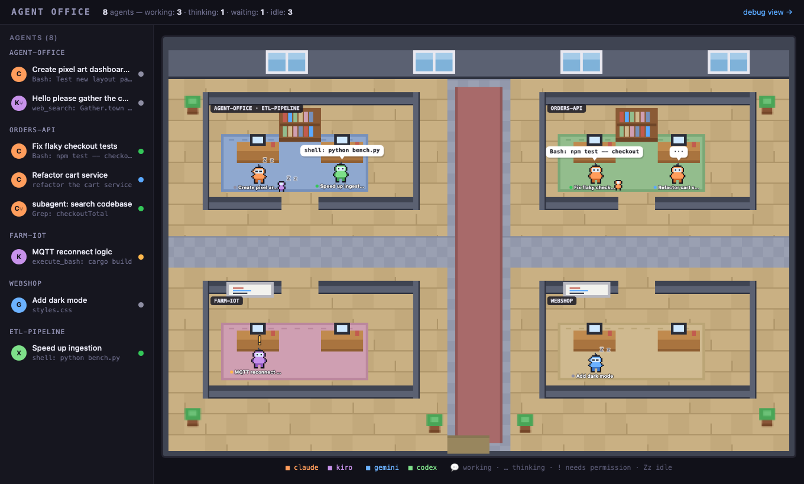

# Agent Office 🏢

A Gather-town-style pixel-art dashboard for monitoring the AI coding agents
running on your machine. Every live CLI session — Claude Code, Kiro CLI, and
(soon) Gemini CLI / GPT Codex — walks into a pixel office, takes a desk in
its workspace's room, and shows you what it's doing in real time.



## What you see

- **One room per workspace** — agents working in the same project directory
  share a room; the nameplate lists the workspace folder name(s).
- **Speech bubbles** with the agent's current activity:
  - `Bash: npm test` — regular tool calls
  - `⚡ /deep-research` — skill / slash-command invocations
  - `🔌 server: tool-name` — MCP tool calls
- **Status at a glance**:
  - 💬 bubble + typing — `working`
  - `…` bubble — `thinking` (prompt sent, no response yet)
  - bouncing `!` — `waiting` (likely blocked on a permission prompt — the
    most useful signal here)
  - `Zz` — `idle`; characters walk out the door when their session ends
- **Subagent minis** — 8×8 mini characters perched next to their parent
  (Claude Agent-tool subagents are detected automatically).
- **Side panel** — Gather-style participants list grouped by workspace, with
  live activity and status dots. Click a row (or a character) for a detail
  card: full title, project path, uptime, token usage, session id.

Everything is read-only: the dashboard watches session files, it never
touches your agents.

## Setup

### Requirements

- Docker (recommended), or Node.js ≥ 20 for a native run
- At least one supported agent CLI that has run on this machine:
  - **Claude Code** — sessions in `~/.claude/projects/`
  - **Kiro CLI** — sessions in `~/.kiro/sessions/cli/`
  - Gemini CLI / GPT Codex — adapters stubbed, see [Roadmap](#roadmap)

### Run with Docker (recommended)

```sh
git clone https://github.com/nnsitem/agent-office.git
cd agent-office
docker compose up --build -d
```

Open **http://localhost:4321** — live agents appear within a couple of
seconds. Sessions idle for more than ~15 minutes at startup are treated as
history and not shown.

The compose file bind-mounts `~/.claude`, `~/.kiro`, and `~/.gemini`
**read-only** into the container. Uncomment the `~/.codex` line once the
Codex adapter lands.

### Run natively (development)

```sh
npm start                # serves http://localhost:4321
PORT=4399 npm start      # custom port
```

A native run additionally checks host processes (`ps`) to detect dead CLIs
faster; inside Docker, liveness falls back to event staleness alone.

### Try it without live agents

```sh
DEMO=1 npm start
```

`DEMO=1` fills the office with fake agents in every state (all four CLI
colors, a subagent mini, a permission-wait, an idle sleeper). Add `?ff=40`
to the URL to fast-forward the walk-in animations after a reload.

## Using the dashboard

| Where | What |
|---|---|
| `http://localhost:4321` | the office |
| `http://localhost:4321/debug.html` | plain table view of the same data |
| `http://localhost:4321/api/agents` | JSON snapshot |
| `http://localhost:4321/events` | SSE stream (`snapshot`, `agent`, `remove`) |

- Click any character or side-panel row for its detail card; click empty
  floor to dismiss.
- Character colors: 🟠 Claude · 🟣 Kiro · 🔵 Gemini · 🟢 Codex.
- Room assignment follows the directory the agent is *working in* (for
  Claude, the launch cwd refined by where its file edits point), so a
  Claude session launched in a parent folder still joins the room of the
  project it's editing — and walks over if that changes mid-session.

## Configuration

| Env var | Default | Purpose |
|---|---|---|
| `PORT` | `4321` | HTTP port |
| `CLAUDE_DIR` | `~/.claude/projects` | Claude Code transcripts |
| `KIRO_DIR` | `~/.kiro/sessions/cli` | Kiro CLI sessions |
| `GEMINI_DIR` | `~/.gemini/tmp` | Gemini CLI sessions (stub) |
| `DEMO` | – | `1` = populate fake agents |
| `DISABLE_PROC_CHECK` | – | `1` = skip host `ps` liveness (auto in Docker) |

## How it works

```
server/
├── index.js          HTTP + SSE + static files (zero dependencies)
├── state.js          normalized agent registry + status heuristics
├── procs.js          host-process liveness (auto-disabled in Docker)
├── watchutil.js      fs.watch + 2s mtime rescan (bind-mount safe), JSONL tailing
└── adapters/         one small module per CLI
web/
├── office.js         canvas renderer (pixel world at 3x, text at full res)
├── sim.js            rooms, desks, corridor pathing, relocation
├── sprites.js        pixel art defined as character grids in code
└── index.html        side panel, detail cards, SSE glue
```

Each adapter watches its CLI's session directory, tail-reads only new JSONL
bytes, and emits a normalized state
(`working / thinking / waiting / idle / gone` + activity + tokens). Status
is derived from the last event kind and its age — e.g. a trailing tool call
with no result for 30s renders the bouncing `!` (probably waiting for your
permission).

### Adding a new agent CLI

Write one file in `server/adapters/` exporting `start(emit)` that calls
`emit({ id, source, project, title, lastEventKind, lastEventAt, activity, … })`,
and register it in `server/index.js`. Nothing else changes — see
`adapters/kiro.js` for the pattern and `PLAN.md` for hard-won notes on
verifying a CLI's real session format before trusting its metadata.

## Roadmap

- **Gemini CLI adapter** — stubbed; finalized against real session data the
  first time Gemini runs on the machine (`~/.gemini/tmp/…`).
- **GPT Codex adapter** — planned; expected `~/.codex/sessions/**/rollout-*.jsonl`.
- See `PLAN.md` for the full design doc, milestone history, and open
  questions.

## Known limitations

- "Waiting for permission" is a heuristic (trailing tool call > 30s) — no
  CLI writes an explicit marker.
- Kiro CLI stamps *every* session `session_created_reason: "subagent"`, so
  Kiro sessions are always shown as full agents (verified 2026-07-06).
- Inside Docker, a killed CLI is only noticed via event staleness (host
  processes aren't visible), so departures can take a few minutes.
